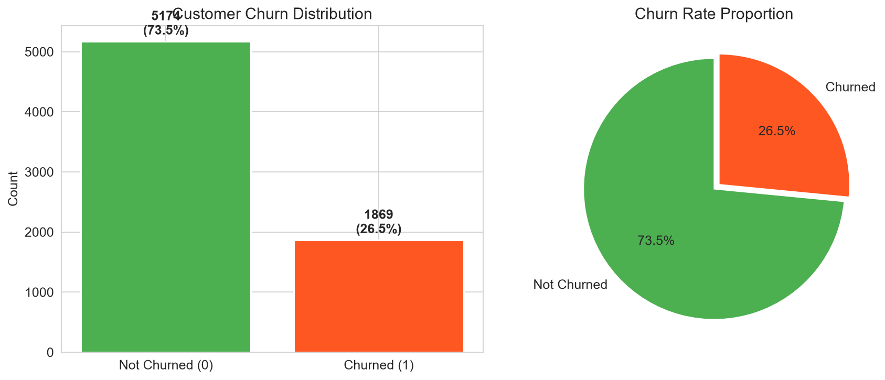
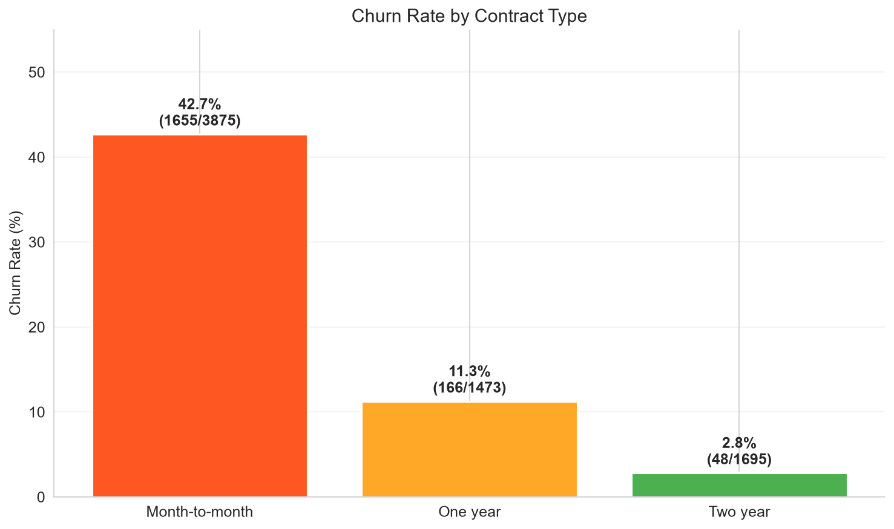
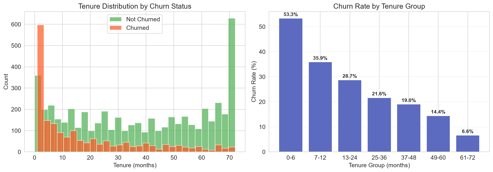
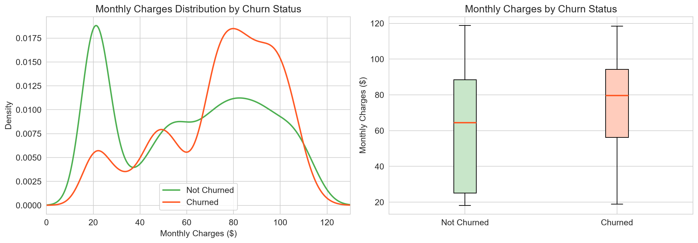
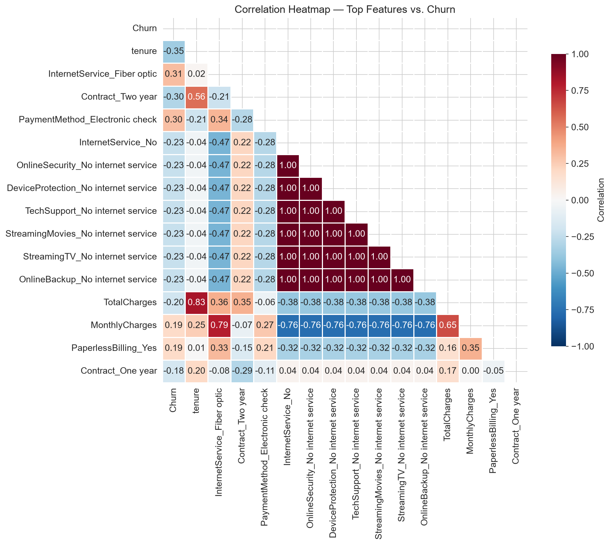
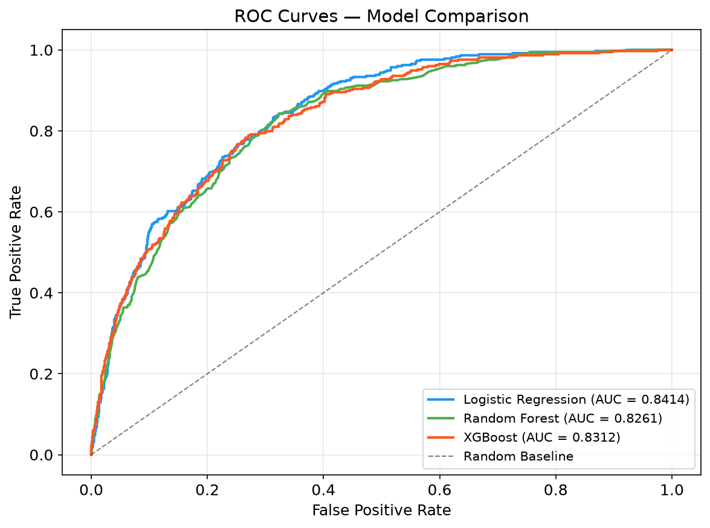
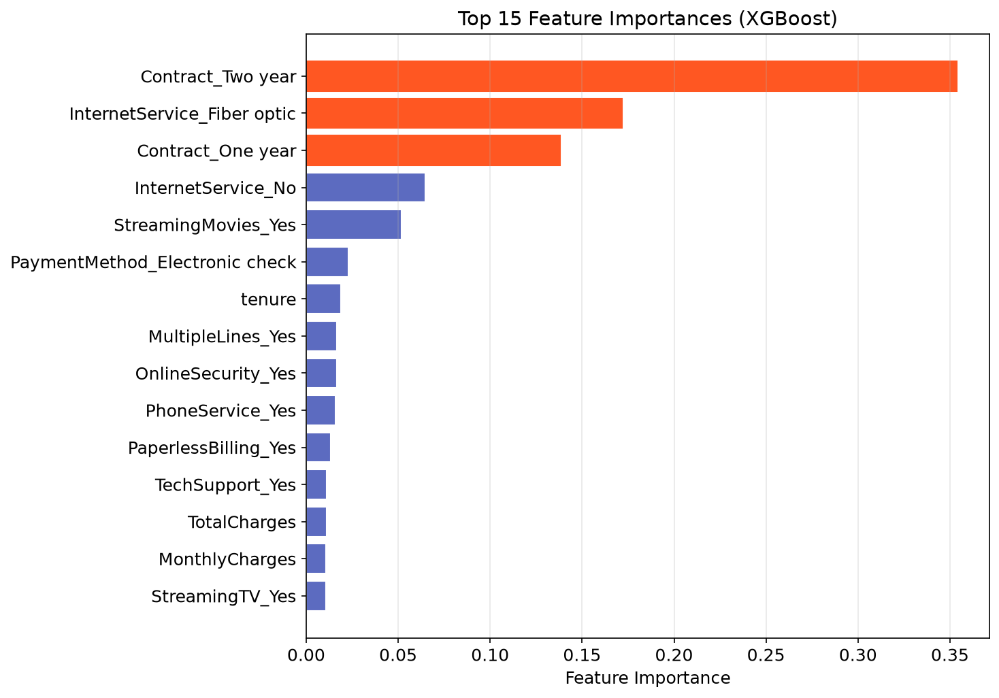
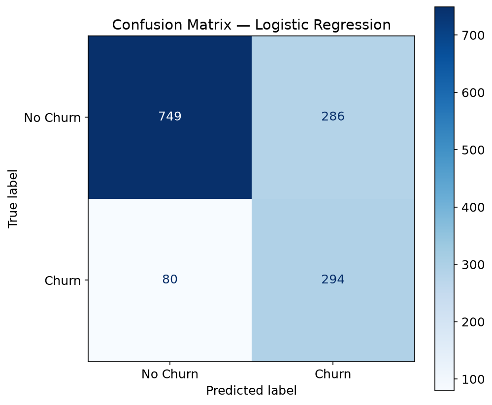

# Customer Churn Prediction — Project Report

## 1. Problem Statement

Customer churn — the loss of clients or subscribers — is one of the most critical challenges facing telecommunications companies today. Acquiring new customers is significantly more expensive than retaining existing ones, often costing 5-7 times more. This project aims to build a predictive model that identifies customers who are likely to churn, enabling proactive retention strategies. By accurately predicting churn risk, telecom companies can intervene with targeted offers, improved service, or personalized outreach before customers leave, thereby reducing revenue loss and improving long-term profitability.

## 2. Dataset Description

- **Source:** IBM Telco Customer Churn Dataset
- **URL:** https://raw.githubusercontent.com/IBM/telco-customer-churn-on-icp4d/master/data/Telco-Customer-Churn.csv
- **Data Type:** REAL, publicly sourced data (not synthetic or generated)
- **Size:** 7,043 customer records with 21 features
- **Target Variable:** `Churn` (Yes/No — whether the customer left within the last month)

**Key Features:**
| Feature | Description |
|---------|-------------|
| tenure | Number of months the customer has stayed |
| Contract | Month-to-month, One year, or Two year |
| MonthlyCharges | Amount charged monthly ($) |
| TotalCharges | Total amount charged over tenure ($) |
| InternetService | DSL, Fiber optic, or No |
| OnlineSecurity | Whether the customer has online security add-on |
| TechSupport | Whether the customer has tech support add-on |
| PaymentMethod | Electronic check, Mailed check, Bank transfer, Credit card |

Additional features include demographics (gender, senior citizen status, partner, dependents) and service details (phone service, multiple lines, streaming TV/movies, device protection, online backup, paperless billing).

## 3. EDA Key Findings

### Overall Churn Rate

The dataset shows a churn rate of approximately 26.5%, meaning roughly 1 in 4 customers churned. This moderate class imbalance was addressed during model training using balanced class weights.

### Churn by Contract Type

Month-to-month contract holders exhibit a churn rate of approximately 42%, compared to just 11% for one-year and 3% for two-year contracts. Contract type is the single strongest predictor of churn.

### Churn by Tenure

New customers (0-6 months) have the highest churn rate (~47-50%), while long-tenured customers (61-72 months) churn below 10%. The first six months represent the critical retention window.

### Churn by Monthly Charges

Customers with higher monthly charges (~$74 average) are more likely to churn compared to retained customers (~$61 average), suggesting price sensitivity plays a significant role.

### Correlation Heatmap

The heatmap reveals strong positive correlations between churn and month-to-month contracts, fiber optic internet, and electronic check payments, while tenure and two-year contracts show strong negative correlations.

## 4. Methodology

### Data Preprocessing
1. **Missing Values:** Identified 11 blank strings in `TotalCharges` corresponding to new customers; converted to numeric and filled with 0.0.
2. **Feature Encoding:** Applied one-hot encoding (`drop_first=True`) to all categorical variables, producing 30 numeric features.
3. **Class Imbalance Handling:** Used `class_weight='balanced'` for Logistic Regression and Random Forest, and `scale_pos_weight` for XGBoost.

### Models Used
1. **Logistic Regression:** A linear baseline model with L2 regularization and feature scaling (StandardScaler). Selected for its interpretability and strong performance on linearly separable data.
2. **Random Forest (200 trees):** An ensemble method that captures non-linear relationships and feature interactions. Provides built-in feature importance rankings.
3. **XGBoost (200 estimators):** A gradient-boosted decision tree algorithm known for strong performance on tabular data. Uses learning rate of 0.1 and max depth of 5.

### Train/Test Split
- 80% training / 20% testing, stratified by the target variable to maintain class proportions.

## 5. Results

### Model Comparison

| Model | Accuracy | Precision | Recall | F1 Score | ROC-AUC |
|-------|----------|-----------|--------|----------|----------|
| Logistic Regression | 0.7402 | 0.5069 | 0.7861 | 0.6164 | 0.8414 |
| XGBoost | 0.7559 | 0.5282 | 0.7513 | 0.6203 | 0.8312 |
| Random Forest | 0.7637 | 0.5463 | 0.6471 | 0.5924 | 0.8261 |

### ROC Curves

### Feature Importance

### Confusion Matrix (Best Model)

The best-performing model is **Logistic Regression** with a ROC-AUC of **0.8414**. This model achieves a good balance between precision and recall, which is critical for churn prediction — we want to catch as many potential churners as possible (high recall) without overwhelming the retention team with false positives (reasonable precision).

## 6. Conclusion & Business Recommendations

Based on our analysis and modeling results, we offer the following actionable recommendations:

1. **Incentivize longer contracts:** Month-to-month customers churn at 42%. Offering discounts (e.g., 10-15% off) for switching to annual or two-year contracts could significantly reduce churn. Even converting 20% of month-to-month customers to annual contracts could reduce overall churn by approximately 5 percentage points.

2. **Implement early-stage retention programs:** With nearly half of new customers churning within the first 6 months, a structured onboarding program with regular check-ins, usage tutorials, and satisfaction surveys during the first 90 days could improve early retention. Consider assigning dedicated support contacts to new customers.

3. **Review fiber optic pricing and service quality:** Fiber optic customers churn more frequently despite (or because of) paying higher prices. This warrants investigating whether service quality meets expectations. Consider offering speed guarantees, bundled support, or competitive pricing to improve value perception.

4. **Bundle value-added services:** Customers with online security and tech support add-ons churn significantly less. Offering these services at discounted bundle prices — or including them free for the first 3 months — could increase perceived value and reduce churn for at-risk customers.

## 7. Limitations

1. **Snapshot data:** The dataset represents a single point-in-time snapshot. Temporal patterns (seasonality, trends) cannot be captured.
2. **Feature completeness:** Customer satisfaction scores, call center interaction data, network quality metrics, and competitive pricing information are not available but would likely improve predictions.
3. **Class imbalance:** While addressed with balanced class weights, more advanced techniques (SMOTE, ensemble resampling) could potentially yield marginal improvements.
4. **Model interpretability vs. performance trade-off:** The best model may be a black-box ensemble; in production, a slightly less accurate but more interpretable model might be preferred for explaining predictions to business stakeholders.
5. **Generalizability:** Results are specific to this telecom dataset and may not directly transfer to other companies or industries without retraining.
